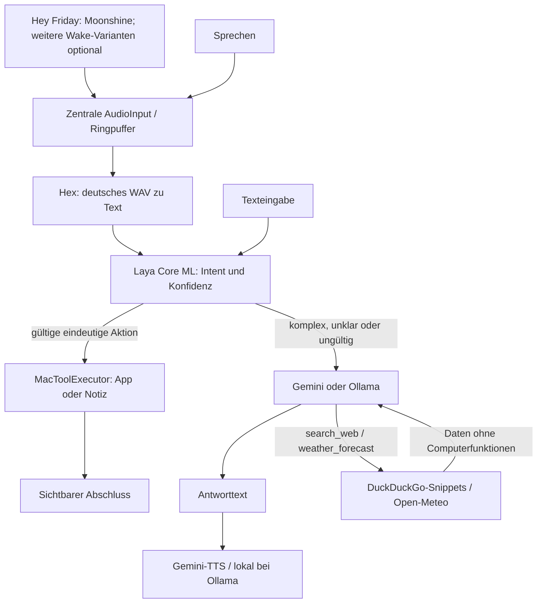

# Architektur der ersten Version

FridayApp verdrahtet reale lokale Provider im gemeinsamen AssistantViewModel.
Die Demo-Provider sind ausschließlich für isolierte Tests verfügbar.

AudioInput ist der einzige Mikrofonbesitzer. Es konvertiert auf 16-kHz-Mono,
puffert acht Sekunden und schickt Samples an den Wake-Worker. Nach einem Wake
beginnt die Aufnahme am gemeldeten Sample-Offset, einschließlich bereits gepufferter
Sprache. Etwa 0,75 Sekunden Stille beenden den Befehl; spätestens nach 30 Sekunden
endet er. Bereits gepufferte Sprache zählt zur Mindestlänge von 0,8 Sekunden.
Hex erhält PCM16-WAV-Dateien über den authentifizierten Loopback-Service.

Laya wählt open_app, search_web, create_note, switch_desktop, find_project, open_folder, open_url, home_control, reasoning oder unknown. Ein separater Parser
akzeptiert nur vollständige unterstützte Aktionen und automatisch entdeckte App-Namen.
Die Live-Konfidenzgrenze 0.75 ist vorläufig: die ersten deutschen Inferenztests
rechtfertigen sie für den Prototyp; weitere Kalibrierung bleibt offen. Ungültige,
trunkierte oder unsichere Entscheidungen führen zum LLM. Ein Toolfehler wiederholt
keine Aktion. Diktat umgeht das Routing und zeigt nur den Text an.

JSONLineProcess besitzt den jeweiligen direkten Helper-Prozess, wartet auf Ready,
ordnet Antworten per UUID zu und beendet Helper bei Deadline oder Abbruch.
Stop wartet auf das Prozessende, bevor ein neuer Prozess startet. Wake-Kontrollen
warten auf ACK; Generationen verwerfen alte Ereignisse. Native Python-Ausgabe ist
vom JSON-Kanal getrennt. Hex-Bearer-Tokens werden nicht geloggt.

Wake ist opt-in. Während Aufnahme, Hex, Laya, Tool, LLM und TTS ist es pausiert.
Nach Abschluss wird es erneut aktiviert, sofern eingeschaltet. Ohne Wake wird das
Mikrofon nach manueller Aufnahme gestoppt. Beenden sperrt neue Starts, cancelt
laufende Tasks, wartet deren Ende ab und stoppt alle eigenen Helper.

NSWorkspace öffnet bekannte installierte Bundle-IDs. Notizen werden atomar im
Friday-Ordner gespeichert. Schreibtischwechsel senden Control + Pfeiltaste mit
Bedienungshilfen-Zugriff. Freie Terminalbefehle, allgemeine Klick-Steuerung und
Cursor-Diktat sind noch offen. Gemini kann höchstens drei typisierte Aktionen an
den Router zurückgeben; dieser validiert alle vor der ersten Ausführung und nutzt
die gleichen lokalen Tools. Gemini-TTS liest Gemini-Antworten standardmäßig vor und
wartet auf Wiedergabeende; einfache Aktionen bleiben stumm.

Das Thinking-Orb-Overlay und das Fenster beobachten dieselben Phasen: idle, listening,
recording, transcribing, deciding, acting, reasoning, speaking, failed. Die native
ThinkingOrbsKit-Version ist unter Vendor gepinnt und mit MIT-Hinweisen gebündelt.
Idle/listening pausieren den 2D-Ring; recording animiert denselben Ring. Acting
nutzt kreisende working-Punkte, reasoning die verschachtelnde solving-Animation. Der
transparente Orb zeigt im Idle keinen Text. Die ViewModel hält das erkannte
Hex-Transkript und einen abbrechbaren Timer (Computeraktion: eine Sekunde,
Frage: acht Sekunden). Generation-Guards
verhindern das Löschen neuer Befehle. Das Panel passt seine Größe an den Text an,
der rechte obere Anker bleibt gleich. Hex-Transkripte sind nach Aufnahmeende verfügbar.
Replay verwendet ausschließlich den letzten Reasoning-Antworttext, suspendiert
Wake und wartet auf TTS-Ende. Busy-State und Generation schützen vor Überschneidung.

GeminiReasoningEngine verwendet die GenerateContent-API mit Header-Authentifizierung,
12-Sekunden-Deadline pro Aufruf und finalem Antworttext ohne Thinking-Parts. Bei
Überlastung wechselt es zwischen primärem Gemini 3.5 Flash-Lite (MINIMAL) und
Gemini 3.8 Flash (LOW); das überlastete primäre Modell pausiert für zwei Minuten.
Der persönliche API-Schlüssel kommt einmal pro Engine-Sitzung außerhalb des
UI-Threads aus der lokalen Credentials-Datei und wird im Arbeitsspeicher gecacht.
Der Store liegt außerhalb von Repo/App-Bundle mit restriktiven Dateirechten.
Beim Speichern eines neuen Schlüssels verwirft die UI den Cache, einschließlich
eines Guards gegen ältere noch laufende Leseoperationen. Kein Keychain-Aufruf im App-Code.
HTTP-Fehler werden sanitisiert. Kurze, vorlesbare Antworten sind der Standard;
Fragen werden nicht automatisch in Notizen umgewandelt. Bis acht Frage-/Antwortpaare (maximal 16.000 Zeichen)
bleiben im Arbeitsspeicher, damit kurze Antworten auf Rückfragen ihren Kontext behalten.
Recherchefunktionen sind auf eine pro Plan begrenzt und nicht mit Computeraktionen
kombinierbar. Quellen stammen nur aus Adapterdaten. Die Folgeantwort erhält keine
Funktionen, nur untrusted Recherche-Inhalte mit klarer System-Anweisung.
Safari-Suchen öffnen einen URL-encoded Google-Suchlink ausdrücklich mit Safari;
sie liefern keine LLM-Zusammenfassung der Ergebnisse. Der Mikrofon-Tap ist explizit
Sendable, weil AVAudioEngine ihn außerhalb des MainActor aufruft.

MacApplicationCatalog liest Namen und Bundle-IDs aus Applications, System-Applications
und dem persönlichen Applications-Ordner. Leerzeichen und Interpunktion im Namen
werden normalisiert; eindeutige kleine Schreibfehler werden korrigiert.
Mehrdeutige Namen werden nicht geraten.
Der Executor aktiviert laufende Apps direkt und öffnet ansonsten die tatsächlich
über Launch Services gefundene Anwendung.
Vollständig erkannte Safari-Suchen werden vor Laya sprachlich normalisiert;
die Klassifikation und Konfidenz bleiben echte Laya-Ausgaben.

`MacProjectLocator` durchsucht höchstens 50 Apps und 20 AX-Fenster pro App mit
kurzen AX-Timeouts und insgesamt drei Sekunden Scan-Budget. Terminal.app liefert
höchstens 80 Tabs und die letzten 4.000 Zeichen ihres sichtbaren Textes über einen
festen JXA-Helper mit strukturierten stdin-Argumenten. Inhalte werden nur lokal
verglichen. Ein einzelner Treffer wird fokussiert, mehrere benötigen eine Auswahl
per opaque ID. Vor Fokus werden Fenstertitel bzw. Fenster-ID, TTY und Projekttext
erneut geprüft. Kein Tab-Index-Fallback, kein Shellbefehl, keine private Space-API.
`find_project` läuft als alleinige Computeraktion; auch ein Gemini-Fallback sendet
Ergebnisse oder Fehler nicht zurück an Gemini/TTS. Abbruch- und Generation-Guards
verhindern die Veröffentlichung alter Treffer nach einem neueren Befehl.

LSUIElement macht das gebündelte Friday zur Menüleisten-App ohne Dock-Icon.
MenuBarExtra verwendet ein statisches Template-Rendering des gepunkteten Kugel-Orbs.
Das Einstellungsfenster wird im AppDelegate erst beim Öffnen erzeugt und danach
wiederverwendet. Beim Start entsteht nur das transparente Overlay.

Die Erweiterung v8 nutzt `CachedDecisionEngine` für hohe, gültige lokale Action-
Entscheidungen. Exact-text keys, 64 Einträge, fünf Minuten, Helper-Epoch-Guards;
keine Effekte werden gecacht. `HomeAssistantClient` ist ein separater Actor mit
privatem Store, 60-s-Gerätekatalog, generation-geschützten Requests und strikt
begrenzten HA-Diensten. `findSafariTab` nutzt denselben lokalen Auswahlweg wie
Projektsuche; Tab-Inhalte verlassen den Helper nicht. `VoiceController` besitzt
zusätzlich eine abbrechbare Follow-up-Aufnahme mit Sprachbeginn-Timeout. Bare-
und Acoustic-only-Wake sind standardmäßig aus. Fensteraktivität pausiert Orbs;
der vendorte TimelineView-Clock ist auf 24 fps begrenzt.
