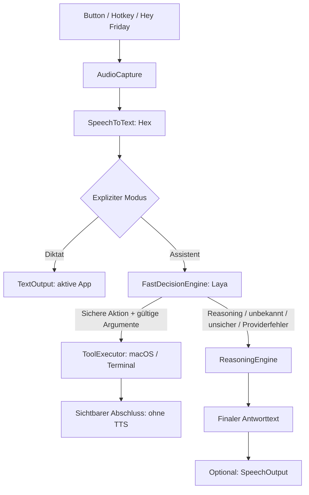

# Architektur

Friday besteht aus einer nativen macOS-Oberfläche, einem unabhängigen Router
und austauschbaren Providern. Die Demo funktioniert ohne Server und Mikrofon.

Die Aktivierung, Audioaufnahme und Texteingabe sind zukünftige Integrationen.
Aktuell beginnt der Ablauf bei manueller Texteingabe. Der Router liefert beim
Diktat nur den Text zurück; erst ein zukünftiger TextOutput fügt ihn am Cursor ein.

## Verantwortlichkeiten

| Vertrag | Aufgabe | Umsetzung im Scaffold |
| --- | --- | --- |
| `AudioCapture` | Aufnahme starten, stoppen, abbrechen; Audio-Datei liefern | Schnittstelle |
| `SpeechToText` | Audio-Datei → Transkript | `HexSpeechToText` meldet „nicht angebunden“ |
| `WakeWordDetector` | Aktivierungsereignisse aus lokaler Erkennung | unkonfigurierter Slot |
| `FastDecisionEngine` | Text → typisierte Entscheidung + Konfidenz | Demo-Regeln; Laya-Slot |
| `ReasoningEngine` | komplexe Anfrage → Antwort | Demo-Platzhalter; Provider-Slot |
| `ToolExecutor` | typisierte Aktion → Ergebnis | `PreviewToolExecutor` |
| `TextOutput` | Diktat in das aktive Textfeld einfügen | Schnittstelle |
| `SpeechOutput` | Antwort vorlesen oder stoppen | System-TTS; ElevenLabs-Slot |

`FridayApp` kennt die konkrete Verdrahtung in `AssistantViewModel`.
`FridayCore` importiert keine Anbieter-SDKs, SwiftUI oder AppKit.
`FridayAdapters` kapselt spätere native Helper, Modell-Clients und Betriebssystemzugriffe.

## Routing

Der Eingabemodus ist explizit. Diktat darf nicht versehentlich Programme öffnen.
Im Assistentenmodus nimmt der Router ausschließlich eine Aktion mit gültigen
Argumenten und ausreichender Konfidenz an. `0.85` ist ein vorläufiger, über den
Konstruktor einstellbarer Wert; echte Laya-Werte müssen mit unseren Befehlen
evaluiert und kalibriert werden.

Nicht endliche oder außerhalb von 0–1 liegende Werte, unbekannte Intents,
fehlende Argumente und Klassifikationsfehler führen zum Reasoning-Provider.
Abbruch führt zu keiner neuen Anfrage. Tool-Fehler werden sichtbar weitergegeben;
der Router wiederholt eine möglicherweise bereits ausgeführte Aktion nicht über das LLM.

Der Laufzeitablauf ist „Hey Friday“ → Hex → Laya → Computeraktion oder LLM.
Nur die LLM-Antwort kann anschließend bei Bedarf vorgelesen werden. Einfache
Computeraktionen und Diktat lösen niemals TTS aus. Der Router meldet über
`onPhase` Entscheidung und die gewählte Route vor dem jeweiligen Provideraufruf.

Laya entscheidet über feste Kandidaten. Ein separater Parser löst beispielsweise
„Safari“ zu einer erlaubten Bundle-ID auf oder extrahiert den Notiztext. Die
gemeinsame Argumentprüfung ist nur strukturell; der echte Executor muss zusätzlich
zulässige Programme, Pfade, Aktionen und Bestätigungen prüfen.

## Computer Use und Terminal

`ToolRequest` bietet `openApplication`, `createNote` und `runExecutable`.
Terminalaktionen tragen einen ausführbaren Pfad, ein Argument-Array und ein
Arbeitsverzeichnis. Eine künftige `Process`-Implementierung übernimmt diese
Felder direkt; Transkripte werden nicht in einen Shell-String eingesetzt.
Für UI-Automatisierung kommt später ein separater Accessibility-Adapter hinzu.

Der Scaffold führt keine dieser Aktionen aus. Aufnahmeberechtigungen,
Accessibility und gegebenenfalls Automation werden bei der echten Integration
an der jeweiligen Funktion angefordert.

## Lebenszyklus der Sprachintegration

Geplante Zustände: idle → listening → transcribing → deciding → Verzweigung:
acting → idle oder reasoning → optional speaking → idle. Wake-Word ist opt-in.
Während Aufnahme und TTS muss die
Wake-Erkennung pausieren, damit Friday nicht auf sich selbst reagiert. Alle
Abbrüche müssen Mikrofon, temporäre Audiodateien und aktive Helper freigeben.
`SpeechOutput.speak` wartet auf Wiedergabeende und wirft bei Stop/Abbruch einen
`CancellationError`. System-TTS verwendet dafür den AVSpeechSynthesizer-Delegate.

## Thinking Orbs

Die native SwiftUI-Version von Libraries.dev liegt als gepinntes lokales Paket
unter `apps/macos/Vendor/ThinkingOrbsKit`; MIT-Lizenz und Upstream-Revision sind
beigefügt. `AssistantOrb` bildet echte Phasen auf dessen Animationen ab:
Bereit/breathing (statisch), Entscheidung/connecting, Aktion/working,
LLM/solving, Sprachausgabe/listening und Fehler/shaping (statisch mit Fehlersymbol).
Fenster und schwebendes Panel beobachten dasselbe `AssistantViewModel` des
App-Delegates. Die gesonderte Orb-Vorschau zeigt alle neun Originalanimationen.
Reduce Motion und Hell-/Dunkelmodus werden vom nativen Renderer berücksichtigt.

## Offene Integrationsgrenzen

Ein Reasoning-LLM allein recherchiert noch nicht im Web. Recherchen benötigen
zusätzliche Browser-/Suchwerkzeuge und Quellen in der Antwort. Provider-Timeouts,
Streaming, Modell-Warm-up und echte End-to-End-Latenzen werden mit den echten
Providern ergänzt. Die Demo behauptet keine Modellqualität oder Sprachlatenz.
