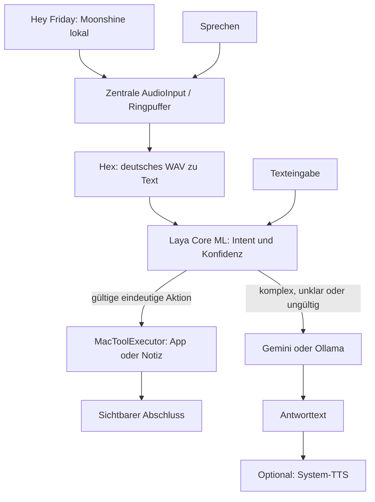

# Architektur der ersten Version

FridayApp verdrahtet reale lokale Provider im gemeinsamen AssistantViewModel.
Die Demo-Provider sind ausschließlich für isolierte Tests verfügbar.

AudioInput ist der einzige Mikrofonbesitzer. Es konvertiert auf 16-kHz-Mono,
puffert acht Sekunden und schickt Samples an den Wake-Worker. Nach einem Wake
beginnt die Aufnahme am gemeldeten Sample-Offset, einschließlich bereits gepufferter
Sprache. Eine Sprechpause beendet den Befehl; spätestens nach 30 Sekunden endet er.
Hex erhält PCM16-WAV-Dateien über den authentifizierten Loopback-Service.

Laya wählt open_app, search_web, create_note, reasoning oder unknown. Ein separater Parser
akzeptiert nur vollständige unterstützte Aktionen und automatisch entdeckte App-Namen.
Die Live-Konfidenzgrenze 0.75 ist vorläufig: die ersten deutschen Inferenztests
rechtfertigen sie für den Prototyp; weitere Kalibrierung bleibt offen. Ungültige,
trunkierte oder unsichere Entscheidungen führen zum LLM. Ein Toolfehler wiederholt
keine Aktion. Diktat umgeht das Routing und zeigt nur den Text an.

JSONLineProcess besitzt den jeweiligen direkten Helper-Prozess, wartet auf Ready,
ordnet Antworten per UUID zu und beendet Helper bei Deadline oder Abbruch.
Stop wartet auf das Prozessende, bevor ein neuer Prozess startet. Wake-Kontrollen
warten auf ACK; Generationen verwerfen alte Ereignisse. Native Python-Ausgabe ist
vom JSON-Kanal getrennt. Hex-Bearer-Tokens werden nicht geloggt.

Wake ist opt-in. Während Aufnahme, Hex, Laya, Tool, LLM und TTS ist es pausiert.
Nach Abschluss wird es erneut aktiviert, sofern eingeschaltet. Ohne Wake wird das
Mikrofon nach manueller Aufnahme gestoppt. Beenden sperrt neue Starts, cancelt
laufende Tasks, wartet deren Ende ab und stoppt alle eigenen Helper.

NSWorkspace öffnet bekannte installierte Bundle-IDs. Notizen werden atomar im
Friday-Ordner gespeichert. Schreibtischwechsel senden Control + Pfeiltaste mit
Bedienungshilfen-Zugriff. Freie Terminalbefehle, allgemeine Klick-Steuerung und
Cursor-Diktat sind noch offen. Gemini kann höchstens drei typisierte Aktionen an
den Router zurückgeben; dieser validiert alle vor der ersten Ausführung und nutzt
die gleichen lokalen Tools. System-TTS liest LLM-Antworten standardmäßig vor und
wartet auf Wiedergabeende; einfache Aktionen bleiben stumm.

Das Thinking-Orb-Overlay und das Fenster beobachten dieselben Phasen: idle, listening,
recording, transcribing, deciding, acting, reasoning, speaking, failed. Die native
ThinkingOrbsKit-Version ist unter Vendor gepinnt und mit MIT-Hinweisen gebündelt.

GeminiReasoningEngine verwendet die GenerateContent-API mit Header-Authentifizierung,
12-Sekunden-Deadline pro Aufruf und finalem Antworttext ohne Thinking-Parts. Bei
Überlastung nutzt es Gemini 3.5 Flash Lite und pausiert das primäre Modell für
zwei Minuten. Der persönliche
API-Schlüssel kommt aus dem macOS-Schlüsselbund. HTTP-Fehler werden sanitisiert.
Safari-Suchen öffnen einen URL-encoded Google-Suchlink ausdrücklich mit Safari;
sie liefern keine LLM-Zusammenfassung der Ergebnisse. Der Mikrofon-Tap ist explizit
Sendable, weil AVAudioEngine ihn außerhalb des MainActor aufruft.

MacApplicationCatalog liest Namen und Bundle-IDs aus Applications, System-Applications
und dem persönlichen Applications-Ordner. Leerzeichen und Interpunktion im Namen
werden normalisiert; eindeutige kleine Schreibfehler werden korrigiert.
Mehrdeutige Namen werden nicht geraten.
Der Executor öffnet die tatsächlich über Launch Services gefundene Anwendung.
Vollständig erkannte Safari-Suchen werden vor Laya sprachlich normalisiert;
die Klassifikation und Konfidenz bleiben echte Laya-Ausgaben.
