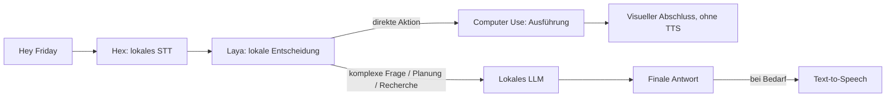

# Friday Local Voice Stack Implementation Plan

> Für die Umsetzung: einzelne Phasen inline oder als klar getrennte Team-Aufgaben abarbeiten.
> Dieser Plan ist noch keine Implementierung. Jeder Provider bekommt einen eigenen kleinen Commit.

**Ziel:** Laya und Hex lokal verbinden, schnelle Computeraktionen ausführen und
eine möglichst offene deutsche Sprachschleife auf macOS bauen.

**Architektur:** Native SwiftUI-App; ein persistenter lokaler Laya-Helfer;
Hex als nativer Helper; TTS und Wake-Aktivierung als Swift-Adapter.
Ein Coordinator besitzt den Audio- und Anfragelebenszyklus.

**Stack:** macOS 15+, Apple Silicon, Swift 6.2+, Python 3.12, Core ML,
Hex/Whisper Turbo, Moonshine Streaming, Ollama/Qwen3, MLX/Qwen3-TTS.

Der zugehörige [Entwurf](../specs/2026-10-04-local-voice-stack-design.md)
beschreibt die Architekturentscheidungen und die betrachteten Alternativen.

## Laufzeitablauf

Aufnahme liegt zwischen Aktivierung und Hex. Diktat ist ein expliziter Nebenmodus
und umgeht Laya. Die nummerierten Phasen unten beschreiben Entwicklungsabhängigkeiten;
sie ändern die obige Reihenfolge nicht. **Direkte Computeraktionen bleiben stumm.**

## 1. Was wir nehmen

| Baustein | Konkrete Auswahl | Warum / Lizenzquelle |
| --- | --- | --- |
| Schnell entscheiden | `laya-coreml==0.2.0` + `aac6fef/laya-multilingual-coreml` | lokal; Multilingual; [Port](https://github.com/mizorewww/laya-coreml) und [Gewichte](https://huggingface.co/aac6fef/laya-multilingual-coreml) Apache-2.0 |
| Diktieren | Hex-Helper, Modell-ID `whisper_large_v3_turbo`, `language=de` | [Hex](https://github.com/anomalyco/hex) MIT; [Whisper-Gewichte](https://huggingface.co/openai/whisper-large-v3-turbo) MIT; deutschen Katalogeintrag beim Setup prüfen |
| „Hey Friday“ | Moonshine Tiny Streaming in Englisch + Phrasenerkennung | [Code und Streamingmodelle](https://github.com/moonshine-ai/moonshine#license) MIT; kein eigenes Phrase-Training nötig |
| Planung / komplexe Fragen | Ollama, zunächst `qwen3:8b` | [Runtime](https://github.com/ollama/ollama) MIT; [Qwen3-8B](https://huggingface.co/Qwen/Qwen3-8B) Apache-2.0 |
| Natürliche lokale Stimme | `mlx-community/Qwen3-TTS-12Hz-0.6B-CustomVoice-4bit` | [Gewichte](https://huggingface.co/mlx-community/Qwen3-TTS-12Hz-0.6B-CustomVoice-4bit) Apache-2.0; [Swift-Runtime](https://github.com/Blaizzy/mlx-audio-swift) MIT; Deutsch ausdrücklich einstellen |
| TTS während des Aufbaus / Rückfall | vorhandenes `SystemSpeechOutput` | sofort verfügbar; keine TTS-API nötig; Apple-Systemstimme ist proprietär |
| Optional bessere Cloud-Stimme | ElevenLabs, `eleven_flash_v2_5` | [deutsche Sprachunterstützung](https://elevenlabs.io/docs/overview/models#flash-v25); proprietär, Account/API-Key und tarifabhängige Kosten |
| Computer Use | AppKit/Accessibility/`Process`, eigene typisierte Tools | vorhandene Toolverträge; keine zusätzliche Agent-Plattform erforderlich |

Die offene lokale TTS wird Standard **nach** dem Hör- und Latenztest. Bis dahin
bleibt die funktionierende Systemstimme auswählbar. Cloud-TTS startet nur nach
expliziter Providerwahl und sendet dann den Antworttext an ElevenLabs; ein Fehler
in lokaler TTS darf keinen stillen Cloud-Wechsel auslösen. Das ist bereits als
optionale Variante vom Nutzer erlaubt, aber aktuell wird kein Account angelegt
und kein kostenpflichtiger Aufruf ausgeführt.

## 2. Erste Phase: lokales Laya mit Texteingabe

Dateien:

- Neu: `services/laya/pyproject.toml`, `services/laya/uv.lock`,
  `services/laya/friday_laya/__main__.py`, `services/laya/intent_schema.json`.
- Neu: `apps/macos/Sources/FridayAdapters/Laya/LayaProcessClient.swift`,
  `LayaDecisionEngine.swift`, `ActionArgumentParser.swift` im selben Ordner.
- Ändern: `ProviderSlots.swift` (Laya-Platzhalter entfernen),
  `AssistantViewModel.swift` (echten Provider verdrahten).
- Prüfen: `services/laya/tests/test_protocol.py`,
  `apps/macos/Tests/FridayAdaptersTests/LayaDecisionEngineTests.swift`.

- [ ] Isolierte Python-3.12-Umgebung anlegen; `laya-coreml==0.2.0` und transitive
  Abhängigkeiten im Lockfile festhalten; `pytest` in die Dev-Abhängigkeiten aufnehmen.
  Zunächst keinen PyTorch-Export installieren.
- [ ] Den 1024-Token-Multilingual-Export einmal explizit herunterladen; Modellrevision,
  Checksums und Lizenz mit dem Snapshot speichern. Laufzeit lädt nur lokale Dateien.
- [ ] Langlebigen Helper implementieren: einmal laden/warm laufen lassen, dann
  JSON-Zeilen mit Request-ID annehmen. stdout enthält nur Protokoll, Logs auf stderr.
- [ ] Eine `choice`-Frage mit `open_app`, `create_note`, `reasoning`, `unknown`
  auswerten. Gewählten Wert und `answer_confidence` übertragen; Entropie-`confidence`
  nicht mit der Wahrscheinlichkeit der gewählten Antwort verwechseln.
- [ ] App-Argumente aus einem bekannten Namenskatalog auf Bundle-IDs auflösen;
  Notizinhalt über dokumentierte deutsche Satzmuster extrahieren. Mehrteilige oder
  unklare Befehle führen zu Rückfrage/Reasoning statt teilweiser Ausführung.
- [ ] Trunkierung oder zusammengefallene Optionen aus `usage` ablehnen;
  ungültige Zahlen und fehlende Argumente niemals als Aktion annehmen.
- [ ] Startbereitschaft, Helper-Absturz, Deadline und Abbruch sichtbar behandeln;
  keine wartenden Requests endlos offen lassen. Verwaiste Child-Prozesse beenden.
- [ ] Mindestens 60 deutsche Beispiele als Entwicklungsdaten und 40 getrennte
  Abnahmefälle sammeln. Konfidenzgrenze anhand dieser Aufgabe kalibrieren;
  der Scaffold-Wert `0.85` ist vorläufig.

Abnahme: „Öffne Safari“, „Mach eine Notiz: …“ und „Plane XY“ werden sinnvoll
geroutet. Inferenz geht nach Setup offline; kalte Ladezeit und warme P50/P95 getrennt
messen. Zuerst Tool-Vorschau beibehalten, bis die separat zurückgehaltenen Fälle
keine unbeabsichtigte Aktion zeigen. Keine feste Millisekunden-Zusage.

Der ANE-L96-Export bleibt eine spätere Optimierung: 96 Token umfassen auch
Frage und Optionen. Für unsere erste breite deutsche Intent-Frage ist das zu eng.
Grundlage: [API und Modellgrenzen](https://github.com/mizorewww/laya-coreml/blob/main/docs/USAGE.md).

## 3. Zweite Phase: Hex und echtes Diktat

Dateien:

- Neu: `Sources/FridayAdapters/Audio/AudioEngineCapture.swift`,
  `AudioFrameSource.swift`, `WAVEncoder.swift` unter `apps/macos/`.
- Neu: `Sources/FridayAdapters/Hex/HexProcessClient.swift`, `HexSpeechToText.swift`.
- Neu: `Sources/FridayAdapters/Text/AccessibilityTextOutput.swift`.
- Ändern: `Contracts.swift` (Audio-Streaming ergänzen), `ProviderSlots.swift`,
  `AssistantViewModel.swift`, `packaging/Info.plist`, `scripts/build-macos.sh`.
- Prüfen: `Tests/FridayAdaptersTests/HexSpeechToTextTests.swift`,
  `WAVEncoderTests.swift`; echte Mikrofon-/Cursor-Tests manuell auf macOS.

- [ ] Kompatible Hex-Version und Helper-Pfad festlegen; für Entwicklung vorhandenes
  Binary oder lokalen Build verwenden. Vor Distribution Helper, Lizenzen und Signierung
  in `Friday.app` bündeln und auf einem sauberen Mac prüfen.
- [ ] Helper direkt mit `service --embedded` starten, Ready-Handshake/API-Version 2
  prüfen und das Bearer-Token nur innerhalb der App halten.
- [ ] Katalog abfragen; das deutsche Turbo-Modell explizit vorbereiten, Fortschritt
  anzeigen und erst nach Warm-up die Aufnahme freigeben.
- [ ] Friday nimmt Audio über eine zentrale Quelle auf. Für STT abgeschlossene
  PCM-WAV-Dateien senden; z. B. 16 kHz Mono. Keine M4A-Datei als WAV deklarieren.
- [ ] Aufnahme per Button/Hotkey starten/stoppen; im Diktatmodus den rohen Text
  direkt am Cursor einfügen. Assistentenmodus verwendet denselben STT-Adapter.
- [ ] Während Recording ist die UI nicht der ursprüngliche Zieleingabefokus;
  Ziel-App vor Aktivierung erfassen. Clipboard-Rückfall nur sichtbar verwenden.
- [ ] Mic- und Accessibility-Berechtigungen funktionsbezogen anfordern; ein fehlendes
  Textfeld liefert eine sichtbare Textvorschau statt blindem Tastatureinfügen.
- [ ] Bei Abbruch des Inferenzrequests den eigenen Helper schließen und auf sein
  Ende warten. HTTP-Abbruch allein garantiert bei Hex nicht das Ende der Inferenz.

Abnahme: deutscher Text in zwei verschiedenen Apps; Aufnahme abbrechen ohne
Einfügen; Modellfehler zeigen eine verständliche Meldung. Die embedded API liefert
finale Transkripte, keine versprochene Live-Transkription.
Grundlage: [Hex-Protokoll und Grenzen](https://github.com/anomalyco/hex/blob/main/docs/specs/local-transcription-service.md).

## 4. Dritte Phase: Tools und LLM-Fallback

Dateien:

- Neu: `Sources/FridayAdapters/Tools/MacToolExecutor.swift`, `NoteStore.swift`,
  `TerminalExecutor.swift`; `Sources/FridayAdapters/Reasoning/OllamaReasoningEngine.swift`.
- Neu: `Sources/FridayApp/AssistantCoordinator.swift`.
- Ändern: `AssistantRouter.swift`, `AssistantViewModel.swift`, `Contracts.swift`.
- Prüfen: `Tests/FridayAdaptersTests/MacToolExecutorTests.swift`,
  `OllamaReasoningEngineTests.swift`; bestehende Routingtests beibehalten.

- [ ] Programme per geprüfter Bundle-ID über `NSWorkspace` öffnen.
- [ ] Notizen zunächst als Markdown in Fridays Application-Support-Verzeichnis
  speichern. Eine spätere Apple-Notes-Integration benötigt einen eigenen Adapter.
- [ ] Terminal nur als typisierten Prozess mit Argument-Array ausführen; in V1 nur
  explizit angebotene/erlaubte Tools, Vorschau und Bestätigung bei verändernden Aktionen.
- [ ] Ollama über die lokale `/api/chat`-API anbinden; `qwen3:8b` einmal herunterladen.
  Modellname bleibt einstellbar. Keine Änderung am separaten Veranstalter-Demo nötig.
- [ ] Antwortstream, Fehler, Kontextgrenze und Abbruch behandeln. Interne Thinking-
  Inhalte von finalem Antworttext trennen und niemals vorlesen.
- [ ] Reasoning darf Tool-Vorschläge liefern; der gemeinsame Executor bleibt für
  Prüfung/Ausführung zuständig. Ein Toolfehler führt nicht zu einem blinden Retry.
- [ ] Einen expliziten Recherche-Adapter planen: z. B. selbst gehostete Suche +
  abrufbare Webseiten. Erst nach Belegabruf eine Antwort mit Quellen liefern;
  Qwen allein ist kein aktuelles Web-Recherchewerkzeug.

Abnahme: App öffnet sich, Notiz wird genau einmal gespeichert, Planungsfrage
bekommt eine reale lokale Antwort. Recherche bleibt bis zum Werkzeuganschluss
als nicht eingerichtet gekennzeichnet. [Ollama-Chat-API](https://docs.ollama.com/api/chat).

## 5. Vierte Phase: offene lokale TTS, optional Cloud

Dateien:

- Neu: `Sources/FridayAdapters/Speech/QwenSpeechOutput.swift`, `AudioPlayback.swift`,
  `SpeechProviderFactory.swift`; später `ElevenLabsSpeechOutput.swift` dort.
- Ändern: `Package.swift`, `SystemSpeechOutput.swift`, `ProviderSlots.swift`,
  `Contracts.swift`, `AssistantCoordinator.swift`, `.github/workflows/macos.yml`.
- Prüfen: `Tests/FridayAdaptersTests/SpeechLifecycleTests.swift`; deutsche Hörtests manuell.

- [ ] Swift-6.2-Toolchain explizit für Team und CI wählen. Die aktuelle Paketmanifest-
  Anforderung ist höher als die teils älteren README-Anforderungen.
- [ ] `mlx-audio-swift` auf geprüfte Revision pinnen; nur TTS/Core-Produkte importieren.
  Den CustomVoice-4-bit-Snapshot plus benötigte Tokenizer-/Codec-Dateien vorbereiten.
- [ ] Deutsch und Preset-Sprecher explizit wählen; zunächst normale Audioerzeugung,
  anschließend gestreamte PCM-Wiedergabe über den gemeinsamen Audio-Player.
- [ ] `SpeechOutput` um Abschluss-/Abbruchereignisse erweitern; AVSpeechSynthesizer-
  Delegate und MLX-Player-Ende müssen denselben Coordinator-Vertrag erfüllen.
- [ ] Modell resident halten und finale LLM-Antworten nur bei Bedarf sprechen;
  direkte Computeraktionen/Diktat niemals vorlesen. Ausgabe unterbrechen können.
  Modellgenerierung nicht auf dem UI-Thread blockieren.
- [ ] 20 deutsche Sätze mit Namen, Zahlen, Umlauten und längeren Antworten vergleichen.
  Zeit bis zum ersten Audio, Verständlichkeit und Speicherlast messen. Bei starkem
  Akzent oder zu langsamer Ausgabe 8-bit/andere Presets prüfen; Systemstimme bleibt verfügbar.
- [ ] MLX-Metal-Ressourcen im gebündelten App-Build prüfen, nicht nur in `swift run`.
- [ ] Optional ElevenLabs hinter demselben Vertrag implementieren: Voice-ID und
  `eleven_flash_v2_5`, API-Key in Keychain, Timeout, Stop und explizite Cloud-Einstellung.
  Kostenlosigkeit nicht voraussetzen; kein automatischer lokaler→Cloud-Rückfall.

Abnahme: lokale deutsche Antwort wird verständlich vorgelesen, Ende/Stop stellt
den Ruhezustand wieder her. Eine Anfrage ohne Cloud-Einstellung bleibt lokal.
Grundlagen: [Qwen3-TTS-Sprachen](https://github.com/QwenLM/Qwen3-TTS),
[Swift-TTS-Verwendung](https://github.com/Blaizzy/mlx-audio-swift/blob/main/Sources/MLXAudioTTS/Models/Qwen3TTS/README.md).

## 6. Fünfte Phase: „Hey Friday“ und vollständige Sprachschleife

Dateien:

- Neu: `Sources/FridayAdapters/WakeWord/MoonshineWakeWordDetector.swift`.
- Ändern: `Package.swift`, `AudioFrameSource.swift`, `AssistantCoordinator.swift`,
  `AssistantView.swift`, `ProviderSlots.swift`; PCM-Ringpuffer im Audio-Modul.
- Prüfen: `Tests/FridayAdaptersTests/WakePhraseTests.swift`,
  `Tests/FridayAppTests/AssistantCoordinatorTests.swift`; Geräuschtests manuell.

- [ ] Moonshine-Swift-Binding und englisches Tiny-Streaming-Modell auf Revisionen
  pinnen; nur das MIT-Streamingmodell verwenden, keine Legacy-Modellvariante.
- [ ] Audioblöcke aus Fridays zentraler Quelle zuführen, statt einen zweiten
  Mic-Transcriber mit eigenem Mikrofon zu starten.
- [ ] Stabile Phrase „Hey Friday“ normalisieren und als Aktivierungsereignis ausgeben;
  keine Substring-Aktivierung bei „Friday“ allein. Opt-in und klarer Listening-Zustand.
- [ ] Ein kurzer PCM-Ringpuffer und die Triggerzeit bewahren den Anfang einer direkt
  anschließenden Anfrage; Wake-Prefix nur an der tatsächlich erkannten Position entfernen.
- [ ] Silenz-Endpunkt/VAD für Hands-free-Aufnahmen ergänzen, Stop-Taste als Rückfall.
- [ ] Erkennung während Aufnahme, Verarbeitung und TTS pausieren; nach Abschluss
  mit kurzem Cooldown wieder aktivieren. Abbruch/Fehler müssen diesen Zustand ebenfalls erreichen.
- [ ] 30 Aktivierungsversuche mit verschiedenen Personen/Akzenten sowie mindestens
  30 Minuten normale Unterhaltung, Musik und eigene TTS testen; Fehlaktivierungen protokollieren.

Abnahme: „Hey Friday, öffne Safari“ durchläuft den echten Pfad, Wake-Phrase gelangt
nicht in eine Notiz, Friday aktiviert sich nicht durch die eigene Ausgabe.
Dies ist ein kleiner Streaming-Spracherkenner mit Phrasenfilter, kein bereits
fertiger spezialisierter Friday-Wake-Word-Checkpoint.
[Moonshine-Plattformen und Swift-Einstieg](https://moonshine-voice.readthedocs.io/en/latest/quickstart/).

## 7. Arbeit im Team und Fertigkriterien

| Arbeitspaket | Kann starten nach | Gemeinsamer Vertrag |
| --- | --- | --- |
| Laya + Argumentparser | sofort | FastDecision, IPC-Antwortschema |
| Hex + Aufnahme + Texteingabe | sofort | zentrale PCM-Quelle, SpeechToText |
| TTS | Abschlussvertrag vereinbart | SpeechOutput + Playback-Ende |
| Tools + Ollama | sofort mit Test-Inputs | ToolRequest, ReasoningEngine |
| Wake-Aktivierung | zentrale Audioquelle verfügbar | WakeWordDetector + Coordinator |

Keine parallelen Änderungen an allen zentralen Dateien: Verträge zuerst gemeinsam
festlegen; Provider können danach in ihren eigenen Ordnern entwickelt werden.

- [ ] In jeder Phase Fixtures/Stub-Tests und `swift test --package-path apps/macos`.
- [ ] Laya-Helper zusätzlich mit `uv run --project services/laya pytest` prüfen.
- [ ] `./scripts/build-macos.sh` erzeugt eine funktionsfähige App inklusive Ressourcen.
- [ ] Nach vorbereitetem Download laufen Laya, STT, lokale TTS und Ollama ohne Netzwerk.
- [ ] App-Beenden stoppt alle app-eigenen Helper; Modelldateien bleiben im lokalen Cache.
- [ ] Release auf einem Mac ohne Entwickler-Checkout prüfen: Python-Laya-Runtime,
  Hex-Binary, Modelle, Metal-Ressourcen, Berechtigungen und Codesign müssen vollständig sein.
- [ ] Modellgewichte nicht in Git committen. Runtime-/Modellrevisionen, Hashes,
  Lizenzen und nötige Notices in einem versionierten Manifest dokumentieren.

Das lokale Referenzgerät hat 32 GiB RAM. Das ist eine Ausgangsbasis für Tests,
keine Zusage für alle Macs. Modell-Warm-up, residente Speicherlast und echte
End-to-End-Zeit messen, bevor wir einen Provider als „schnell“ veröffentlichen.
